# Generative Adversarial Networks (GANs) in PyTorch

### TODO

- [ ] Create codes for all considered GANs:
  - [x] DCGAN [(arXiv)](https://arxiv.org/abs/1511.06434)
  - [x] CondGAN [(paper)](http://cs231n.stanford.edu/reports/2015/pdfs/jgauthie_final_report.pdf)
  - [x] CycleGAN [(arXiv)](https://arxiv.org/abs/1703.10593)
- [ ] Train the relevant models on relevant datasets
- [ ] Generate a birthday gift for my girlfriend

## DCGAN

The DCGAN is a GAN that uses convolutional layers instead of fully connected layers. It was introduced in the paper [Unsupervised Representation Learning with Deep Convolutional Generative Adversarial Networks](https://arxiv.org/abs/1511.06434) by Alec Radford, Luke Metz, and Soumith Chintala. During the expreriment, I trained the model on the MNIST digit dataset. The model was trained for 10 epochs, using the training specification provided in the beforementioned paper and the results are shown below.

	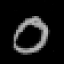
	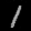
	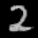
	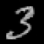
	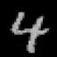
	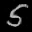
	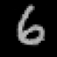
	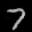
	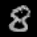
	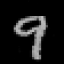

## CondGAN

Conditional Generative Adversarial Network (CondGAN) apart from an input noise, also takes a  class label as a part of the input, for both generator and discriminator. By this modification, the model is able to generate images of a specific class. The model was train on the MNIST dataset, and already after one epoch was able to generate digits with provided label. During the next 2 epochs, the quality of generated images was slowly increasing, resulting in the model used for creating the examples below (3 epochs). Over the next few epochs, the model's accuracy (assessed by hand) started to decay, most likely due to overfitting of the discriminator. The results are shown below:

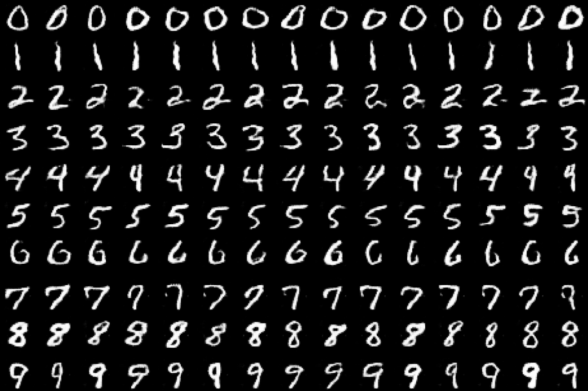

## CycleGAN

Although Conditional GANs are able to generate images of a specific class (based on the provided context), and could be applied to image-to-image translation, their training would require the dataset to contain matching images for different classes. However, in many cases, such datasets are not available. CycleGANs are able to overcome this problem, introducing a novel architecture consisting of two generators and two discriminators. The generators are trained to transform images from one domain to another, while the discriminators are trained to distinguish between the original and transformed images. The model was trained for 30 epochs on the [monet2photo](https://people.eecs.berkeley.edu/~taesung_park/CycleGAN/datasets/monet2photo.zip) dataset with the following results:

#### Monet's paintings -> Real photos

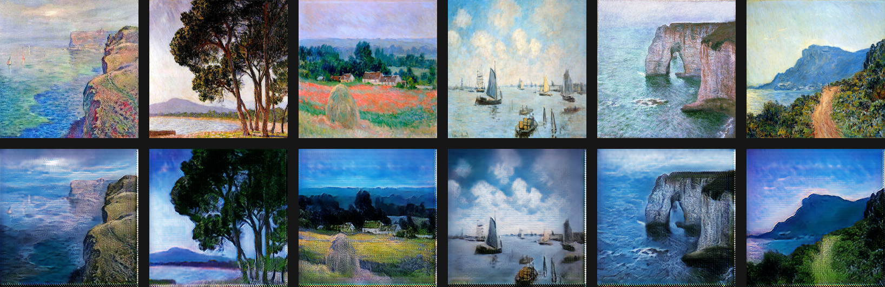
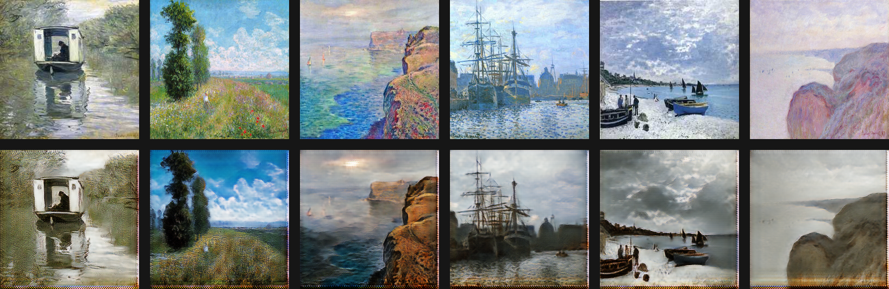

#### Real photos -> Monet's paintings

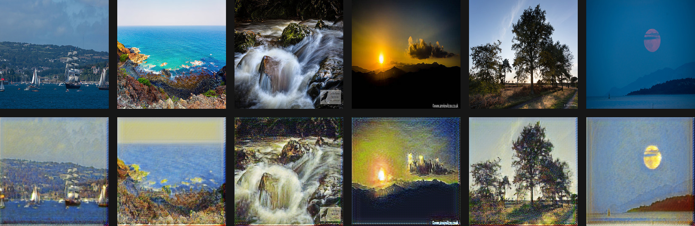
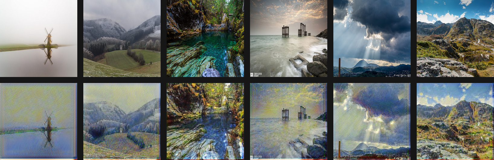